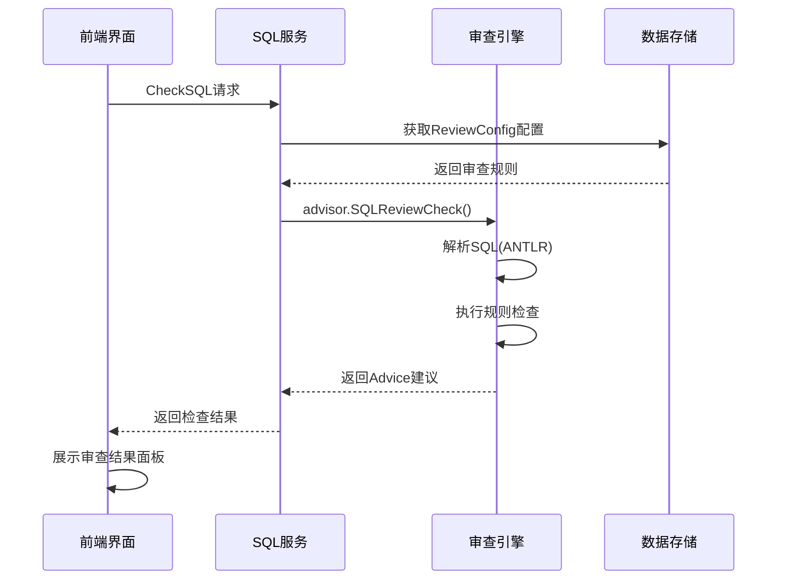

# Bytebase SQL 审查模块深度分析报告

## 🎯 概述

Bytebase SQL 审查模块是该平台的核心功能之一，提供了企业级的 SQL 质量控制和最佳实践检查。该模块通过可配置的规则引擎，支持多种数据库引擎的 SQL 语句分析和建议。

## 🏗️ 核心架构分析

### 1. **整体架构设计**

```
┌─────────────────────────────────────────────────────────────┐
│                    前端用户界面层                              │
│  ┌─────────────────┐  ┌─────────────────┐  ┌─────────────────┐ │
│  │  SQL编辑器      │  │  审查结果面板    │  │  配置管理界面    │ │
│  └─────────────────┘  └─────────────────┘  └─────────────────┘ │
└─────────────────────────────────────────────────────────────┘
                                │
                            gRPC-Web
                                │
┌─────────────────────────────────────────────────────────────┐
│                     API 服务层                               │
│  ┌─────────────────┐  ┌─────────────────┐  ┌─────────────────┐ │
│  │  SQLService     │  │ ReviewConfigSvc │  │  其他服务       │ │
│  └─────────────────┘  └─────────────────┘  └─────────────────┘ │
└─────────────────────────────────────────────────────────────┘
                                │
                          advisor.SQLReviewCheck()
                                │
┌─────────────────────────────────────────────────────────────┐
│                   SQL 审查引擎核心                            │
│  ┌─────────────────┐  ┌─────────────────┐  ┌─────────────────┐ │
│  │   Advisor接口   │  │   规则注册器    │  │   AST解析器     │ │
│  │                 │  │   (Register)    │  │   (ANTLR)       │ │
│  └─────────────────┘  └─────────────────┘  └─────────────────┘ │
└─────────────────────────────────────────────────────────────┘
                                │
                        ┌───────┼───────┐
                        │       │       │
┌─────────────────┐  ┌─────────────────┐  ┌─────────────────┐
│   MySQL规则库   │  │ PostgreSQL规则库│  │  Oracle规则库   │
│   (97个文件)    │  │   (69个文件)    │  │   (23个文件)    │
└─────────────────┘  └─────────────────┘  └─────────────────┘
                                │
┌─────────────────────────────────────────────────────────────┐
│                     数据存储层                               │
│  ┌─────────────────┐  ┌─────────────────┐                   │
│  │ ReviewConfig    │  │   审查结果缓存   │                   │
│  │ 持久化存储      │  │                 │                   │
│  └─────────────────┘  └─────────────────┘                   │
└─────────────────────────────────────────────────────────────┘
```

### 2. **核心接口设计**

**Advisor 核心接口** (`backend/plugin/advisor/advisor.go:61-64`)：
```go
type Advisor interface {
    Check(ctx context.Context, checkCtx Context) ([]*storepb.Advice, error)
}
```

**审查上下文结构** (`backend/plugin/advisor/advisor.go:36-59`)：
```go
type Context struct {
    DBSchema              *storepb.DatabaseSchemaMetadata
    ChangeType            storepb.PlanCheckRunConfig_ChangeDatabaseType
    PreUpdateBackupDetail *storepb.PreUpdateBackupDetail
    ClassificationConfig  *storepb.DataClassificationSetting_DataClassificationConfig
    ListDatabaseNamesFunc base.ListDatabaseNamesFunc
    InstanceID            string
    IsObjectCaseSensitive bool

    // SQL review rule special fields
    AST     any
    Rule    *storepb.SQLReviewRule
    Catalog *catalog.Finder
    Driver  *sql.DB

    CurrentDatabase string
    Statements      string
    UsePostgresDatabaseOwner bool
}
```

## 🔧 审查规则体系分析

### 1. **规则注册机制**

规则通过插件化的注册机制进行管理：

```go
// backend/plugin/advisor/advisor.go:74-84
func Register(dbType storepb.Engine, advType Type, f Advisor) {
    advisorMu.Lock()
    defer advisorMu.Unlock()
    if f == nil {
        panic("advisor: Register advisor is nil")
    }
    dbAdvisors, ok := advisors[dbType]
    if !ok {
        advisors[dbType] = make(map[Type]Advisor)
        dbAdvisors = advisors[dbType]
    }
    if _, dup := dbAdvisors[advType]; dup {
        panic("advisor: Register called twice for advisor " + advType)
    }
    dbAdvisors[advType] = f
}
```

### 2. **多数据库引擎支持**

系统支持多种数据库引擎，每种引擎有专门的规则实现：

| 数据库引擎 | 规则文件数量 | 主要规则类型 |
|------------|--------------|--------------|
| **MySQL** | 97个文件 | 表结构、索引、语句、命名约定 |
| **PostgreSQL** | 69个文件 | 并发索引、编码规范、函数限制 |
| **Oracle** | 23个文件 | 字符集、标识符规范 |
| **MSSQL** | 21个文件 | 跨库查询、存储过程限制 |

### 3. **规则实现模式分析**

以 MySQL 表需要主键规则为例 (`backend/plugin/advisor/mysql/advisor_table_require_pk.go:33-60`)：

```go
type TableRequirePKAdvisor struct{}

func (*TableRequirePKAdvisor) Check(_ context.Context, checkCtx advisor.Context) ([]*storepb.Advice, error) {
    root, ok := checkCtx.AST.([]*mysqlparser.ParseResult)
    if !ok {
        return nil, errors.Errorf("failed to convert to mysql parse result")
    }

    level, err := advisor.NewStatusBySQLReviewRuleLevel(checkCtx.Rule.Level)
    if err != nil {
        return nil, err
    }

    checker := &tableRequirePKChecker{
        level:   level,
        title:   string(checkCtx.Rule.Type),
        tables:  make(tablePK),
        line:    make(map[string]int),
        catalog: checkCtx.Catalog,
    }

    for _, stmtNode := range root {
        checker.baseLine = stmtNode.BaseLine
        antlr.ParseTreeWalkerDefault.Walk(checker, stmtNode.Tree)
    }
    // ... 检查逻辑
}
```

### 4. **规则分类体系**

根据文件命名模式，审查规则主要分为以下几类：

- **命名规约** (`advisor_naming_*`): 表名、列名、索引命名规范
- **列约束** (`advisor_column_*`): 列类型、长度、默认值、NOT NULL等
- **表约束** (`advisor_table_*`): 主键要求、外键限制、表注释等
- **索引优化** (`advisor_index_*`): 索引类型、重复索引检查等
- **语句规范** (`advisor_statement_*`): DML/DDL语句规范
- **性能优化** (`advisor_stmt_*`): 查询性能、执行计划分析
- **安全规范** (`advisor_*_disallow_*`): 禁用特定功能或语法

## 🌐 前后端交互流程分析

### 1. **SQL检查触发流程**



### 2. **关键API调用点**

在 `backend/api/v1/sql_service.go:1606` 处，SQL审查的核心调用：

```go
res, err := advisor.SQLReviewCheck(ctx, s.sheetManager, statement, reviewConfig.SqlReviewRules, context)
if err != nil {
    return storepb.Advice_ERROR, nil, status.Errorf(codes.Internal, "failed to exec SQL review with error: %v", err)
}
```

### 3. **前端组件架构**

前端SQL检查相关的核心组件：

- **SQLCheckButton** (`frontend/src/components/IssueV1/components/SQLCheckSection/SQLCheckButton.vue`):
  - 触发SQL检查的按钮组件
  - 显示检查进度状态
  - 集成错误处理和用户提示

- **SQLCheckPanel**:
  - 展示详细的审查结果
  - 支持代码位置定位
  - 提供强制继续选项

### 4. **审查配置管理**

**ReviewConfigService** (`backend/api/v1/review_config_service.go`) 提供完整的配置管理：

```go
type ReviewConfigService struct {
    v1pb.UnimplementedReviewConfigServiceServer
    store          *store.Store
    licenseService enterprise.LicenseService
}

// 主要方法：
// - CreateReviewConfig: 创建审查配置
// - ListReviewConfigs: 列出所有配置
// - UpdateReviewConfig: 更新配置
// - DeleteReviewConfig: 删除配置
```

## 📊 数据存储层设计

### 1. **审查配置数据模型**

```go
// backend/store/review_config.go:16-22
type ReviewConfigMessage struct {
    ID      string
    Enforce bool
    Name    string
    Payload *storepb.ReviewConfigPayload
}
```

### 2. **配置示例**

项目根目录的 `sql-review-override.yml` 展示了典型的配置格式：

```yaml
template: bb.sql-review.prod
ruleList:
  - type: naming.index.pk
    level: WARNING
  - type: naming.index.fk
    level: WARNING
  - type: naming.index.uk
    payload:
      format: "^idx_{{table}}_unique_{{column_list}}$"
  - type: column.no-null
    level: WARNING
  - type: table.no-foreign-key
    level: DISABLED
```

## 🚀 技术亮点分析

### 1. **插件化架构设计**

- **高扩展性**: 通过 `Register()` 机制，支持动态注册新的审查规则
- **数据库无关**: 统一的 `Advisor` 接口抽象不同数据库的差异
- **规则隔离**: 每种数据库引擎的规则实现完全独立

### 2. **ANTLR语法解析集成**

系统使用ANTLR作为SQL语法解析器，支持：
- **精确的语法树分析**: 基于AST进行规则检查，避免正则表达式的局限
- **多方言支持**: 针对不同数据库SQL方言的专门解析器
- **错误定位**: 提供精确的代码行号和位置信息

### 3. **分级建议系统**

```go
// backend/plugin/advisor/advisor.go:25-34
func NewStatusBySQLReviewRuleLevel(level storepb.SQLReviewRuleLevel) (storepb.Advice_Status, error) {
    switch level {
    case storepb.SQLReviewRuleLevel_ERROR:
        return storepb.Advice_ERROR, nil
    case storepb.SQLReviewRuleLevel_WARNING:
        return storepb.Advice_WARNING, nil
    }
    return storepb.Advice_STATUS_UNSPECIFIED, errors.Errorf("unexpected rule level type: %s", level)
}
```

支持 **ERROR**、**WARNING**、**DISABLED** 三个级别，灵活控制审查严格程度。

### 4. **企业功能集成**

- **许可证控制**: SQL审查功能需要企业许可证激活
- **权限管理**: 集成IAM系统进行访问控制
- **审计日志**: 记录所有审查活动和配置变更

## 📈 性能优化策略

### 1. **实例级缓存**
系统在 `backend/store/instance.go:50` 中实现了实例缓存机制：
```go
if v, ok := s.instanceCache.Get(getInstanceCacheKey(*find.ResourceID)); ok && s.enableCache {
    return v.(*InstanceMessage), nil
}
```

### 2. **语句阈值控制**
通过 `STATEMENT_SKIP_CHECK_THRESHOLD` 常量避免超大SQL文件的性能问题

### 3. **并发检查支持**
规则检查支持并发执行，提高大型SQL文件的处理效率

## 🔍 设计模式分析

### 1. **策略模式 (Strategy Pattern)**
- 每个审查规则实现都是一个独立的策略
- 运行时可动态选择和组合不同规则

### 2. **访问者模式 (Visitor Pattern)**
- ANTLR ParseTreeWalker 使用访问者模式遍历语法树
- 规则检查器作为访问者处理特定节点

### 3. **工厂模式 (Factory Pattern)**
- 规则注册器充当工厂，根据数据库类型创建对应的审查器

### 4. **观察者模式 (Observer Pattern)**
- 审查结果通过事件机制通知前端界面更新

## 📝 改进建议

### 1. **规则可视化编辑器**
- 开发图形化的规则配置界面，降低配置门槛
- 支持规则模板和预设方案

### 2. **AI辅助规则生成**
- 基于历史数据和最佳实践，智能推荐审查规则
- 支持自然语言描述转换为规则配置

### 3. **性能基准测试**
- 集成数据库性能基准测试，提供性能影响评估
- 支持EXPLAIN计划分析和优化建议

### 4. **规则统计分析**
- 提供规则触发频率统计
- 团队SQL质量趋势分析dashboard

## 🎯 总结

Bytebase 的 SQL 审查模块展现了企业级数据库管理系统的**高质量架构设计**：

### **🏆 核心优势**

1. **可扩展性极强**: 插件化的规则注册机制支持快速添加新规则
2. **多数据库支持**: 针对MySQL、PostgreSQL、Oracle等主流数据库的专门优化
3. **精准语法分析**: 基于ANTLR的AST解析，远超正则表达式的准确性
4. **企业级集成**: 许可证控制、权限管理、审计日志完备
5. **用户体验优秀**: 实时检查、可视化结果展示、强制继续选项

### **🔧 技术实现亮点**

- **210+ 规则实现**覆盖SQL质量的方方面面
- **统一接口抽象**使得规则开发标准化且易于维护
- **分层架构设计**实现了良好的职责分离
- **性能优化策略**包含缓存机制和阈值控制

### **📚 学习价值**

这个模块是学习以下技术和设计模式的绝佳案例：
- **插件化架构设计**
- **策略模式和访问者模式应用**
- **ANTLR语法解析器集成**
- **企业级规则引擎实现**
- **前后端分离的复杂业务流程设计**

**对于想要学习 Bytebase 代码的开发者，SQL 审查模块是理解整个系统设计思路的优秀入口点，它展现了如何将复杂的业务需求转化为可维护、可扩展的代码架构。**

---

**报告生成时间**: 2025-09-16
**分析范围**: Bytebase v3.5.2 SQL审查模块完整架构
**技术栈**: Go + Vue.js + ANTLR + gRPC + Protocol Buffers

此报告为深度代码分析结果，涵盖了SQL审查模块从架构设计到具体实现的所有关键方面，适合用于技术学习、架构参考和系统优化。